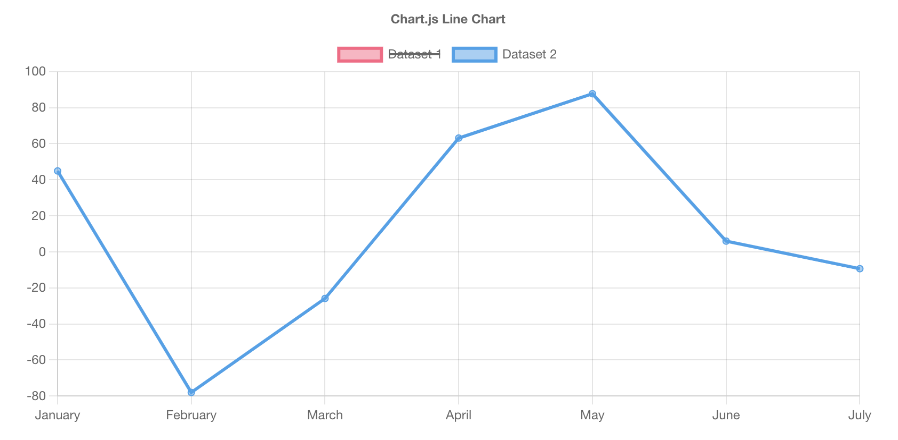
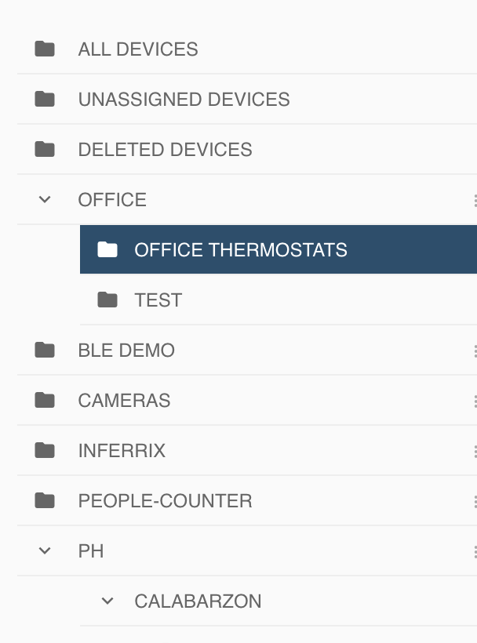

# INOVITI FRONTEND DEV PRACTICAL TEST


## GOAL
Test candidates expertise in building reusable ui components.

## OVERVIEW
This test is built to help us assess the following aspects.

1. How you understand and solve a problem.
2. How closely you following specifications.
3. Your familiarity with the technology of your choice.
4. How you leverage existing tools/libraries to help you solve the problem.

## PREREQUISITES
For this test, the candidate must have familiarity with any of the following frontend frameworks. You may choose to solve the problem using the framework you are most familiar with.
1. vuejs
2. angular
3. reactjs

## REQUIREMENTS
### 1. Chart Component

create a chart component that enables visualization of a set of data. You may use any chart library of your choice ie: [chartjs](https://www.chartjs.org/)


#### input:
 a. `series`
sample value
```
series = {
    data: [100, 10, 14]
    categories: [isodate1, isodate2, isodate3]
}
```
 b. `chartType` - enables changing the display type of the chart.
possible values: `line`, `bar`


### 2. Tree List Component
Create a tree list component. If a node has children, that node should be collapsable and expandable

#### input:
a. `tree`
Sample values
```
tree = [
        {
            label: "node1",
            children: [
                {
                    label: "node1-child"
                }
            ]
        },
        {
            label: "node2"
        },
        {
            label: "node3"
            children: [
                {
                    label: "node3-child"
                }
            ]
        }
    ]
]
```
### ADDITIONAL TASKS
1. Create a video explainer showing the components in action.
2. Optional, for better component presentation, you may integrate the component with [storybook]([https://](https://storybook.js.org/))

###


